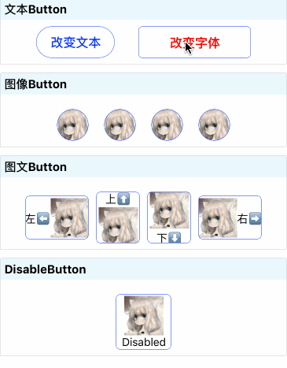

# AnimatedButton

AnimatedButton is a pure JavaScript Component which can change the style of Button from unactive to active by animations. Users could set the normal style and active style to get what effect they wants.
Also the Text and Source could change by touch event.

## Demo



## Installation

`npm install react-native-animated-button -save`

## Documentaion

### Usage
```javascript	
import Button from 'react-native-animated-button';
	
class Demo extends Component {
	render() {
    	return (
        <Button/>
    	)	
      }
 }
 
```
### Examples
```
<Button
            style={{marginTop:10,alignSelf:'center', height: 55,width:80, backgroundColor: 'white', borderWidth: 1 / PixelRatio.get(), borderColor: '#0033FF', borderRadius: 5}}
            imageStyle={{height:50,width:50}}
            activeStyle={{marginTop:10,alignSelf:'center',height: 55,width:100, backgroundColor: 'white', borderWidth: 1 / PixelRatio.get(), borderColor: '#0033FF', borderRadius: 5}}
            source={require('./jpg/head.jpg')}
            text="左⬅️️"
            animated={true}
            type="iconLeft"
            onLongPress={() => {
          console.log('onLongPress...');
        }}
            onPress={() => {
          console.log('onPress...');
        }}
            onPressIn={() => {
          console.log('onPressIn...');
        }}
            onPressOut={() => {
          console.log('onPressOut...');
        }}
          >
```
## Props
- `animated` (Boolean) `false` - animated or not for Button
- `animations` (Object) animations for the style of Button from unactive to active 
- `onPressIn`(Function) callback when pressin
- `onPressOut`(Function) callback when pressout
- `type` (Oneof:(['iconLeft', 'iconRight', 'iconTop', 'iconBottom'])) `iconBottom` - the relative position for Image and Text
- `style` (Style)  - style of the Button which is unactive 
- `activeStyle` (Style)  - style of the Text which is active 
- `text` (String)  - text in Button
- `activeText` (String)  - text when Button is active
- `fontStyle` (Style)  - style of the Text which is unactive 
- `activeFontStyle` (Style)  - style of the Text which is active 
- `source` (Source) - source of Image which is unactive 
- `activeSource` (Source) - source of Image which is active 
- `imageStyle` (Style)  - style of the Image which is unactive 
- `activeImageStyle` (Style)  - style of the Image which is unactive 


